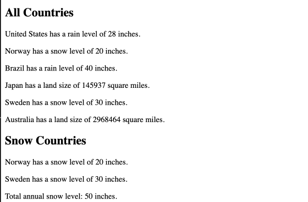

# Project Overview

This is a TypeScript-based application manages information about various countries. It allows you to filter and display countries based on characteristics such as rainfall, snow levels and land size.

There are 3 Countries in the system: Rainy, Snowy and Island country.

## Features

- Interface: The ICountry interface defines basic structure for all country types
- RainyCountry, SnowyCountry IslandCountry implement ICountry interface
- In our demo case, we use filter function to filter only snow countries


## Technologies Used

- TypeScript
-  HTML
- CSS
- Node.js
## Setup and Installation

To get the project running locally, follow the steps below.

### 1. Clone the Repository

Clone the repository to your local machine using Git:

```
git clone https://github.com/cxz161530/cs601HWK4TypeScript
Using 'npm install' in terminal to install dependency
npx tsc will compile your code from typescript to javascript


```
### 2. Sample Output




### 3. Enjoy the webpage!
